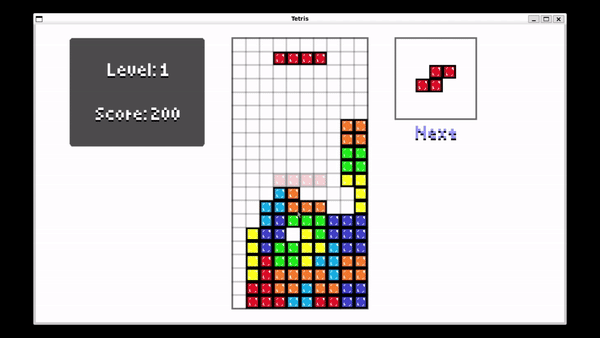

# Tetris

This repository contains an implementation of the classic game Tetris, built using the Love2D game framework. The game features traditional Tetris gameplay mechanics, including line clearing, score accumulation, and increasing difficulty levels.

The game's graphics are simple yet appealing, and the controls are intuitive and responsive, providing a smooth gaming experience. The implementation also includes a scoring system that rewards players for clearing multiple lines at once.

Left and Right keys can be used to move the block around and the Up key is used to rotate it, Down key makes the block fall faster.

## Demo

## Prerequisites

- Love2D game framework (version 11.5)

## Getting Started

Clone the repository:
~~~bash
   git clone https://github.com/Thurzinhu/Tetris
~~~

Go to the folder of the game you want to test 
~~~bash
    cd Tetris/
~~~

Run game with
~~~bash
    love .
~~~